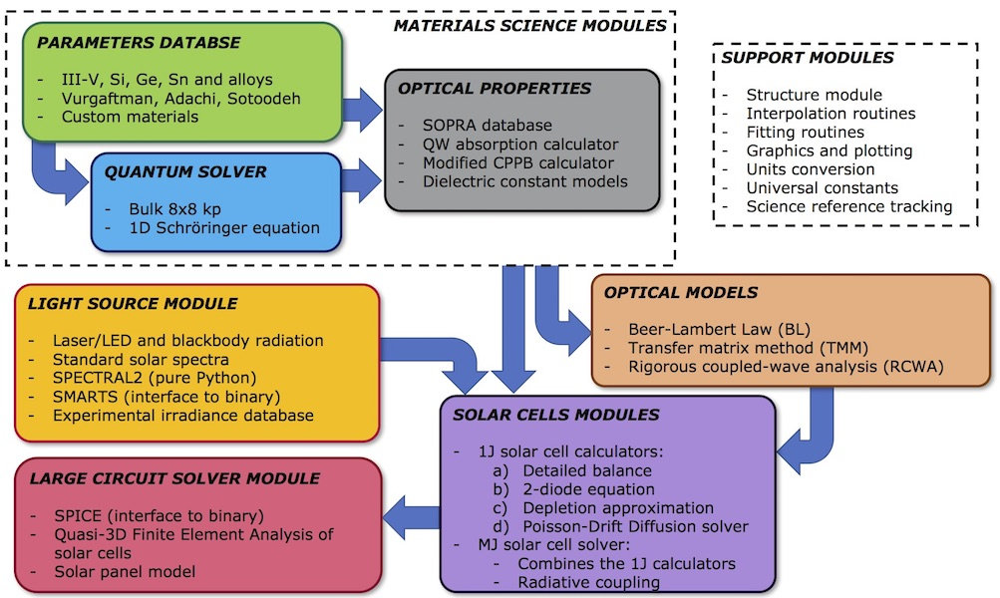

 

Solcore
=======

**Solcore** was born as a modular set of tools, written (almost) entirely in Python 3, to address some of the task we had to solve more. With time, however, it has evolved as a complete semiconductor solver able of modelling the optical and electrical properties of a wide range of solar cells, from quantum well devices to multi-junction solar cells. 

Please, visit [Solcore\'s Documentation](http://solcore5.readthedocs.io), the [Tutorial](docs/source/tutorial.md) for a step-by-step example of how to use *Solcore* to model a solar cell and also check the [Examples folder](examples) for more specific information and examples of usage. 

Contributors
------------

Solcore is the result of many years of developement by many people,
trying to put together in a consistent way the tools that the [Quantum
Photovoltaics Group at Imperial College London](https://www.imperial.ac.uk/quantum-photovoltaics/) needs for its
research in solar cells and photovoltaics. The list of contributors
(hopefully I am not forgetting anyone!) is:

-   Diego Alonso-Álvarez
-   Thomas Wilson
-   Phoebe Pearce
-   Markus Führer
-   Daniel Farrel
-   Tomos Thomas
-   Alvin Chan
-   Ned Ekins-Daukes