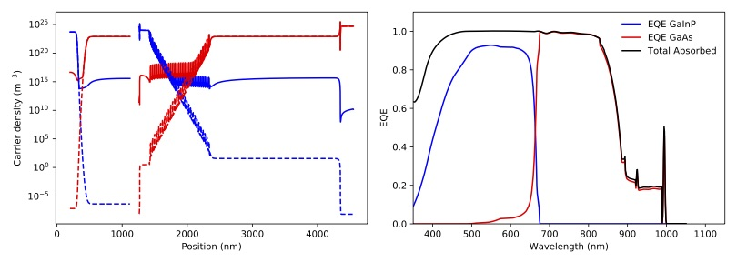
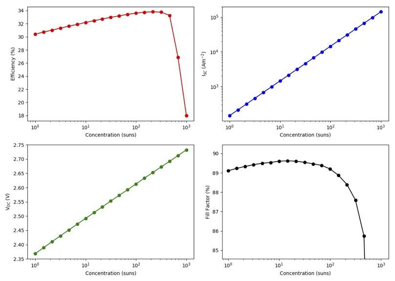
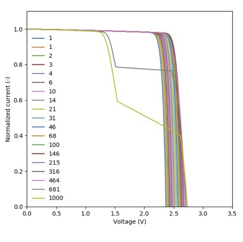

Tutorial
========

This tutorial will guide you, step-by-step, in the creation of a solar cell and the calculation of their properties using *Solcore*.

**What do we have?**

- Dual junction GaInP/GaAs solar cell, lattice matched to GaAs. 
- The bottom cell has 30 strained-balanced quantum wells (QW), made of GaAsP/InGaAs.
- There is a tunnel junction in between the subcells.
- There is a dual layer anti-reflecting coating on the front made of MgF-ZnS

**What do we want to find out?**

- The absorption properties of our QWs
- The QE of the solar cell
- Its efficiency (Eff), short circuit current (Isc), open circuit voltage (Voc) and fill factor (FF) as a function of the concentration. 

Let's get started!

Defining the structure
----------------------

First we need to create the solar cell structure. It is made of several bits and pieces: the QWs, 2xJunctions, 1x tunnel junction and the ARC. We start with the first.

**Defining the QWs:**

```python
from solcore import material
from solcore.structure import Layer
import solcore.poisson_drift_diffusion as PDD
import numpy as np

T = 300 
wl = np.linspace(350, 1050, 1001) * 1e-9

# First, we create the materials of the QW
QWmat = material('InGaAs')(T=T, In=0.2, strained=True)
Bmat = material('GaAsP')(T=T, P=0.1, strained=True)
i_GaAs = material('GaAs')(T=T)

# The QW is 7 nm wide, with GaAs interlayers 2 nm thick at each side and GaAsP barriers 10 nm thick.
# The final device will have 30 of these QWs.
QW = PDD.CreateDeviceStructure('QW', T=T, repeat=30, substrate=i_GaAs, layers=[
    Layer(width=10e-9, material=Bmat, role="barrier"),
    Layer(width=2e-9, material=i_GaAs, role="interlayer"),
    Layer(width=7e-9, material=QWmat, role="well"),
    Layer(width=2e-9, material=i_GaAs, role="interlayer"),
    Layer(width=10e-9, material=Bmat, role="barrier") ])

# We solve the quantum properties of the QW, leaving the default values of all parameters
QW_list = PDD.SolveQWproperties(QW, wavelengths=wl)
```

The first few lines import the *Solcore* utilities needed to define the structure, including the *material* function, the *Layer* class and the Poisson-Drift-Diffusion solver. After that, we create the materials that will made the QWs and create a "Device structure". We will use these structure just to be able to solve the QWs afterwards and transform it into a sequence of layers with effective properties that the PDD solver understands. The call to "CreateDeviceStructure" has several inputs, including the temperature, the substrate, the number of repetition of the QWs and the structure of the layers. The call to "SolveQWproperties" will, indeed, use the utilities within the *quantum_mechanics* module to calculate the band structure of the QWs, their absorption coefficient and, finally, will calculate effective bandgap, density of states, etc. that the PDD solver will use. Although the device will have 30 quantum wells, only one unit (the one indicated in *Layers*) will be modelled as an isolated QW.  

If we only want to solve the properties of the QWs, without creating an effective structure for the PDD solver, we will use, instead:

```python
from solcore import material
from solcore.structure import Layer, Structure
import solcore.quantum_mechanics as QM

T = 300 

# First, we create the materials of the QW
QWmat = material('InGaAs')(T=T, In=0.2, strained=True)
Bmat = material('GaAsP')(T=T, P=0.1, strained=True)
i_GaAs = material('GaAs')(T=T)

# The QW is 7 nm wide, with GaAs interlayers 2 nm thick at each side and GaAsP barriers 10 nm thick.
QW = Structure([Layer(width=10e-9, material=Bmat, role="barrier"),
                Layer(width=2e-9, material=i_GaAs, role="interlayer"),
                Layer(width=7e-9, material=QWmat, role="well"),
                Layer(width=2e-9, material=i_GaAs, role="interlayer"),
                Layer(width=10e-9, material=Bmat, role="barrier") ], 
                substrate = i_GaAs)

# Finally, the quantum properties are calculated here
output = QM.schrodinger(QW)                     
```

While *Solcore* can solve the Schrödinger equation in a structure with any number of layers, the absorption calculator for QWs can only deal properly with single QWs. That is the reason of modelling only 1 QW despite having 30 in the structure. This will clearly represent a limitation when modelling the absorption of superlattices, where there is a strong coupling between neighbouring QWs. 

In the code above, we have used the "PDD.SolveQWproperties" and "QM.schrodinger" functions with the default values, but they both can have a number of optional input parameters to define the number of confined states to calculate, the energy of quasiconfined states, electric field, boundary conditions, etc. Please, visit the documentation of those functions to find out all the available options.

**Defining the junctions:**

In order to calculate the properties of a solar junction using the PDD solver, we need to give all the layers and materials the junciton is made of, in a similar way we have done for the QWs. One thing to note is that if *Solcore* cannot find a property it needs to solve the PDD equations, *it will take the corresponding property for GaAs as a default value*. So, be sure you provide all the required values or that you are happy with the defaults. 

***NOTE***: The different code snippets are additive in order to get a final, complete script. Normally, all the "import" statements would be packed together at the beginning. 

```python
from solcore.structure import Junction

T = 300 

## Materials for the BOTTOM junction
window_bottom = material('GaInP')(T=T, Nd=5e24, In=0.49)
n_GaAs = material('GaAs')(T=T, Nd=1e24)
p_GaAs = material('GaAs')(T=T, Na=8e22)
bsf_bottom = material('GaInP')(T=T, Na=5e24, In=0.49)

GaAs_junction = Junction([Layer(width=10e-9, material=window_bottom, role="Window"),
                          Layer(width=150e-9, material=n_GaAs, role="Emitter")] +
                         QW_list +
                         [Layer(width=2000e-9, material=p_GaAs, role="Base"),
                          Layer(width=200e-9, material=bsf_bottom, role="BSF")], sn=1e6, sp=1e6, T=T, kind='PDD')

## Materials for the TOP junction
window_top = material('AlInP')(T=T, Nd=5e23, Al=0.53)
n_GaInP = material('GaInP')(T=T, Nd=5e23, In=0.49)
p_GaInP = material('GaInP')(T=T, Na=8e22, In=0.49)
bsf_top = material('AlInP')(T=T, Na=5e24, Al=0.53)

GaInP_junction = Junction([Layer(width=120e-9, material=n_GaInP, role="Emitter"),
                           Layer(width=800e-9, material=p_GaInP, role="Base")], sn=1e3, sp=1e3, T=T, kind='PDD')
```

As it can be seen, while we have defined the window and back surface field layer (BSF) for the TOP junction, we have not included it into the Junction definition. The reason for this is that very wide bandgap materials cause convergence problems when doing calculations under illumination, specially when working as the front-most window layers or in distributted Bragg reflectors, where there are very abrupt changes of properties in pery short distances. In order to account for their presence, two things are done: (1) the surface recombination velocity of the top junction is set to a low value to mimic the passivating effect of the window and BSF layers, and (2) the missing layers are added outside the Junction object when creating the full solar cell in order to consider their optical properties (see below). 

**TRICK:** The TMM solver work best with "thin" layers therefore, if the results of optical calculations look strange, try dividing thick layers (> 2-3 µm) into thinner ones (~500 nm). The reason is that the waves propagating forwards and backwards, leading to interference are ultimately complex exponentials that increase (or decrease) quite fast away from the interfaces, resulting in a loss of numerical accuracy when they trying to interact far from the interfaces. 

The only tunnel junction of this solar cell will be defined according to the parametric model and we will assume it is made of GaInP layers, 40 nm-thick in total, that will block part of the light reaching the bottom junction. Since the top junction is also made of GaInP, most of the light should already be absorbed and therefore it should not represent a very important loss. We will use a relatively low peak current to demonstrate the effect of tunnel junction breakdown when working at high concentration.

```python
from solcore.structure import TunnelJunction

tunnel = TunnelJunction([Layer(width=40e-9, material=n_GaInP, role="TJ")],
                        v_peak=0.2, j_peak=7.5e4, v_valley=1, j_valley=4e4, prefactor=5, j01=1e-23, kind='parametric')
```

**Defining the AR coating:**

The AR coating will reduce the front surface reflection and, therefore, increase the photocurrent of the solar cell. We use a simple dual layer coating made of MgF2 and ZnS. Both materials are available in the SOPRA database of optical constants ("MgF2" and "ZnScub", respectively). The data for MgF2 only extends to 900 nm, but we will assume its optical properties will be similar at longer wavelengths, extrapolating the available data.  

```python
MgF2 = material('MgF2')()
ZnS = material('ZnScub')()
```

**Creating the solar cell:**

With all the materials and structures defined, we just need to put everything together, including the front window layer and the BSF layer of the top junction that we had left outside.

```python
from solcore.solar_cell import SolarCell

my_solar_cell = SolarCell([Layer(width=110e-9, material=MgF2, role="ARC1"),
                           Layer(width=60 - 9, material=ZnS, role="ARC2"),
                           Layer(width=30e-9, material=window_top, role="window"),
                           GaInP_junction,
                           Layer(width=100e-9, material=bsf_top, role="BSF"),
                           tunnel,
                           GaAs_junction],
                           T=T, substrate=n_GaAs)
```

Calculating the external quantum efficiency
-------------------------------------------

With the structure fully defined, now it is possible to calculate its behavior as solar cell. We first calculate the external quantum efficiency at 1 Sun of intensity using the AM1.5g solar spectrum. The code that defines the spectrum to use and lunch the calculation will be:

```python
from solcore.solar_cell_solver import solar_cell_solver
from solcore.light_source import LightSource

light_source = LightSource(source_type='standard', version='AM1.5g', x=wl,
                           output_units='photon_flux_per_m', concentration=1)

solar_cell_solver(my_solar_cell, 'qe',
                  user_options={'light_source': light_source, 'wavelength': wl, 'optics_method': 'TMM'})

```

The calculation will proceed in several stages: (1) The structure is processed and discretized, (2) the problem is solved under equilibrium, (2) the problem is solved under short circuit conditions increasing in small steps the intensity of the illumination, and (3), the quantum efficiency is calculated, one wavelength at a time. This is done for the two junctions. The following code plots the electrons and holes densities at equilibrium (dashed line) and at short circuit (continuous line), as well as the EQE of the two junctions and the total absorption in the layers. 

```python
from solcore.solar_cell_solver import solar_cell_solver
from solcore.light_source import LightSource

light_source = LightSource(source_type='standard', version='AM1.5g', x=wl,
                           output_units='photon_flux_per_m', concentration=1)

solar_cell_solver(my_solar_cell, 'qe',
                  user_options={'light_source': light_source, 'wavelength': wl, 'optics_method': 'TMM'})

```



As it can be seen, the minority carrier population increases significantly under illumination, specially in the QW region of the bottom cell, which is a relatively thick, undoped region. The EQE of the bottom junction, in comparison with the total absorbed light, indicates excellent carrier collection with only some missing carriers in the region of the spectrum where light is absorbed by the QWs. The top junction is not performing that well, the reason being a combination of low mobility of carriers in GaInP between 3 and 6 times smaller than that of p-GaAs), insufficient thickness to absorb all light (part of it reaching the GaAs junction), parasitic absorption of the AlGaP window layer and surface recombination.   

Calculating the IV characteristics
----------------------------------

The calculation of the current-voltage characteristics proceed in a similar way. In this case, care must be taken to use the correct polarity for the (internal) voltage sweep, and the polarity of the tunnel junction, already defined above as *pn*. As the optical properties have already been calculated, we set the *optics_method=None*, so they are not calculated again. The next code shows the definition of the voltages, the sunlight concentration factor (from 1 to 1000 suns) and the execution of the calculation within a for loop.

**NOTE**: This example will take several hours to run due to the presence of QWs, which increase the number of mesh points in the bottom cell to several thousand. To have an example of the results faster, reduce the number of concentrations (19 in the example) and comment the QWs related line in the definition of the GaAs junction above.

```python
con = np.logspace(0, 3, 19)
vint = np.linspace(-3.5, 4, 600)
V = np.linspace(-3.5, 0, 300)

allI = []
isc = []
voc = []
FF = []
pmpp = []

for c in con:
    light_source.options['concentration'] = c

    solar_cell_solver(my_solar_cell, 'iv',
                      user_options={'light_source': light_source, 'wavelength': wl, 'optics_method': None,
                                    'light_iv': True, 'mpp': True, 'voltages': V, 'internal_voltages': vint})
                                    
    isc.append(my_solar_cell.iv['Isc'])
    voc.append(my_solar_cell.iv['Voc'])
    FF.append(my_solar_cell.iv['FF'])
    pmpp.append(my_solar_cell.iv['Pmpp'])
    allI.append(my_solar_cell.iv['IV'][1])
```
The next figure shows the summary of the efficiency, Isc, Voc and fill factor (FF) versus concentration. 



The efficiency of the cell is just above 30\% at 1 sun, and increases with concentration , peaking at around 200-300 suns. Further increasing the concentration rapidly decreases the efficiency. Both, Isc and Voc follow the expected linear trend in log-log and semilog plots, respectively, while the fill factor increases for low concentrations and then continuously drops from 20 suns and, specially, from 200 suns. The initial smooth drop of the fill factor can be related with a limited carrier transport across the QW region, that under concentration, suffers from charge accumulation and damping of the electric field. However, the abrupt drop at higher concentrations is related to the failure of the tunnel junction which, by design, had a low peak current. This effect can be better seen in the last figure where, for the two highest concentrations, the IV curve exhibit steps due to the tunnel junction limiting the current. 



